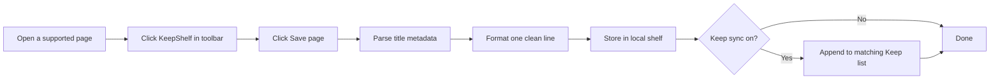

# KeepShelf

<p align="center">
  
</p>

<p align="center">
  <strong>A Chrome extension that turns any IMDb, Letterboxd, Goodreads, MyAnimeList, or Google Search page<br>
  into a one-click save to your personal watchlist, reading list, and bookmark shelf.</strong>
</p>

<p align="center">
  <a href="manifest.json"></a>
  <a href="manifest.json"></a>
  <a href="LICENSE"></a>
  <a href="package.json"></a>
  
  
</p>

<p align="center">
  <a href="../../releases/latest"></a>
</p>

<p align="center">
  <a href="#-quick-start">Quick start</a> ·
  <a href="#-features">Features</a> ·
  <a href="#-supported-sources">Sources</a> ·
  <a href="#-tabs-links--notes">Bookmarks</a> ·
  <a href="#-google-keep-sync">Keep sync</a> ·
  <a href="#-install-from-github">Install</a> ·
  <a href="#-faq">FAQ</a>
</p>

---

## Screenshots

<p align="center">
  
  
  
  
</p>

---

## At a glance

| | |
|---|---|
| **What it does** | Reads title metadata from supported pages and saves a clean formatted entry to your local shelf with one click |
| **Also works as** | A lightweight bookmark manager: save the current tab or paste any URL and click it later to reopen |
| **Where data lives** | Locally in Chrome storage on your device. Optional sync to your own Google Keep notes |
| **Who it is for** | Anyone building a watchlist, reading list, anime list, or link collection without copy-pasting or tab-hoarding |
| **Setup time** | ~2 minutes to load the extension. ~5 minutes to link Keep notes if you want sync |
| **Cost** | Free and open source. No accounts, no API keys, no cloud backend |

---

## Table of contents

- [Why KeepShelf exists](#-why-keepshelf-exists)
- [Quick start](#-quick-start)
- [How it works](#-how-it-works)
- [Features](#-features)
- [Supported sources](#-supported-sources)
- [Tabs, links, and notes](#-tabs-links--notes)
- [Output format](#-output-format)
- [Install from GitHub](#-install-from-github)
- [Usage guide](#-usage-guide)
- [Google Keep sync](#-google-keep-sync)
- [Privacy and data](#-privacy-and-data)
- [Permissions explained](#-permissions-explained)
- [Development](#-development)
- [FAQ](#-faq)
- [Troubleshooting](#-troubleshooting)
- [Contributing](#-contributing)
- [License](#-license)
- [GitHub repo metadata](#-github-repo-metadata)

---

## 💡 Why KeepShelf exists

Someone sends ten movie and book recommendations. The usual workflow looks like this:

1. Google the title
2. Copy the name, year, and rating by hand
3. Switch to Google Keep or a notes app
4. Paste one formatted line
5. Repeat nine more times

That takes minutes per title. KeepShelf reduces it to **open popup → Save page → done**.

You stay on the page you are already on. KeepShelf reads the knowledge panel or page metadata, formats a single clean line, stores it locally, and (if you enable it) pushes that line into the right Google Keep checklist in the background.

No copy-pasting. No tab juggling. No spreadsheet middleman.

---

## ⚡ Quick start

**Fastest path:** download the latest ZIP from the [Releases page](../../releases/latest), extract it, then load it unpacked in Chrome. Done in under two minutes with no tools needed.

Want to build from source instead? See [Install from GitHub](#-install-from-github).

Once the extension is loaded:

1. Pin KeepShelf to your Chrome toolbar.
2. Open a movie on IMDb, an anime on MyAnimeList, a book on Goodreads, or search anything on Google.
3. Click the **KeepShelf icon** in your toolbar, then click **Save page**.
4. Your item appears in the shelf instantly.

Want automatic Keep sync? Jump to [Google Keep sync](#-google-keep-sync).

---

## 🔄 How it works



**Step by step**

1. **Detect:** KeepShelf runs on supported pages and reads title, year, runtime or seasons, author, and ratings.
2. **Parse:** metadata is extracted from page JSON-LD, knowledge panels, or DOM.
3. **Save:** click **Save page** in the popup. Duplicates are detected and skipped automatically.
4. **Sync:** if Keep sync is enabled, the formatted line is appended to the matching Google Keep checklist in the background.

---

## ✨ Features

### Save media with one click

Open the KeepShelf popup on any supported page and click **Save page**. KeepShelf parses the title, year, runtime, rating, and author automatically. No typing required.

Supported media types:

| Type | What gets captured |
|------|--------------------|
| **Movies** | Title, year, runtime, IMDb or Letterboxd rating |
| **Series** | Title, year, latest season count, IMDb rating |
| **Anime** | Title, year, episode count, MAL score |
| **Books** | Title, author, published year, Goodreads or BookFilter rating |

### Smart, consistent formatting

Every saved item becomes a single readable line:

```
The Dark Knight (2008) | 2h 32m | IMDb 9.0
Dark (2017) | S03 | IMDb 8.7
One Piece (1999) | MAL 8.73 (A)
The Alchemist (Paulo Coelho) | 1988 | GR 3.92
```

Ratings are labeled by source: `IMDb`, `LB` (Letterboxd), `MAL` (MyAnimeList), `GR` (Goodreads), `BF` (BookFilter). Anime entries are marked with `(A)`.

### Three-tab shelf

The popup has three independent tabs:

| Tab | Stores |
|-----|--------|
| **Media** | Movies, series, and anime (filterable by type) |
| **Books** | Books from any source |
| **Tabs** | Saved tabs, links, and notes (see below) |

### Bookmark manager built in

The **Tabs** shelf tab works like a personal bookmark manager:

- **Save this tab:** saves the current browser tab with its title and URL
- **Paste a URL:** type or paste any URL to save it as a link
- **Write a note:** type any text to save it as a quick note
- **Click to open:** clicking a saved tab or link reopens it in a new tab

### Clipboard export

- **Copy all:** exports every visible item as plain text, one line each
- **Copy selected:** select items with checkboxes, then copy just those

### Duplicate detection

Saving the same title, URL, or note twice shows a "Already saved" message and skips the duplicate locally and in Keep.

### Google Keep sync

Link your own Google Keep checklists. Every new save can auto-append to the matching note:

- Media (movies, series, anime) go to your **Media note**
- Books go to your **Books note**
- Tabs, links, and notes go to your **Tabs note**
- No Google Cloud project or OAuth app required
- Works with a personal `@gmail.com` account
- Duplicate lines are skipped automatically

### Privacy-first by design

Everything stays on your device unless you turn on Keep sync. No analytics. No external APIs. No third-party data collection.

---

## 🌐 Supported sources

| Source | Page type | Captures |
|--------|-----------|----------|
| [Google Search](https://www.google.com) | Knowledge panel on search results | Movies, series, anime, books |
| [IMDb](https://www.imdb.com) | Title pages (`/title/tt…`) | Movies and TV with IMDb rating |
| [Letterboxd](https://letterboxd.com) | Film pages (`/film/…`) | Title, year, runtime, LB rating |
| [MyAnimeList](https://myanimelist.net) | Anime pages (`/anime/…`) | Title, year, episode count, MAL score |
| [Goodreads](https://www.goodreads.com) | Book pages (`/book/show/…`) | Title, author, year, GR rating |
| [BookFilter](https://www.book-filter.com) | Book pages (`/books/…`) | Title, author, year, BF rating |
| [Series Graph](https://seriesgraph.com) | Show pages (`/show/…`) | Series with season count and IMDb rating |

### Tips for best results

**Google Search**
- For anime, include the word `anime` in your query so the panel is classified correctly.
- If a book save is missing the author, scroll the knowledge panel down to load more details, then save again.

**IMDb, Letterboxd, MAL, Goodreads**
- Wait for the full page to load before clicking Save page.
- Use the canonical title page URL, not a list, review, or profile URL.

---

## 🔖 Tabs, links, and notes

The **Tabs** shelf is a lightweight bookmark manager built into KeepShelf. Switch to the **Tabs** tab in the popup to use it.

### Save the current tab

Click **Save tab** in the toolbar to bookmark the page you are on right now. The title and URL are saved automatically.

### Save a link

Paste any URL into the input box and click **Save**. The hostname becomes the title and the URL is stored for later.

### Write a quick note

Type any text (not a URL) into the input box and click **Save**. It is stored as a note.

### Open a saved tab or link

Click the title or URL of any saved tab or link in the list. It opens in a new tab, exactly like clicking a bookmark.

### Copy or delete

Select items with checkboxes and use **Copy selected** or the delete button, same as the Media and Books tabs.

---

## 📋 Output format

Every saved item becomes one line. These are real examples of the format KeepShelf produces:

### Movies

```
The Shawshank Redemption (1994) | 2h 22m | IMDb 9.3
Inception (2010) | 2h 28m | LB 4.23
The Dark Knight (2008) | 2h 32m | IMDb 9.0
```

### Series

```
Dark (2017) | S03 | IMDb 8.7
Breaking Bad (2008) | S05 | IMDb 9.5
Daredevil (2015) | S03 | IMDb 8.6
```

### Anime

```
One Piece (1999) | MAL 8.73 (A)
Death Note (2006) | 37 eps | MAL 8.62 (A)
Attack on Titan (2013) | MAL 9.0 (A)
```

### Books

```
The Kite Runner (Khaled Hosseini) | 2003 | GR 4.36
The Alchemist (Paulo Coelho) | 1988 | BF 3.78
A Game of Thrones (George R. R. Martin) | 1996
```

### Tabs and links

```
GitHub | https://github.com
YouTube | https://www.youtube.com/watch?v=dQw4w9WgXcQ
```

Use **Copy all** in the popup to export your entire shelf as plain text, ready to paste anywhere.

---

## 📦 Install from GitHub

There are two ways to install KeepShelf. Choose the one that suits you.

---

### Option A: Download a release (recommended, no tools required)

1. Go to the [**Releases page**](../../releases/latest).
2. Download `KeepShelf-vX.X.X.zip` from the Assets section.
3. Extract the ZIP to a permanent folder on your computer (do not delete it after loading).
4. Open `chrome://extensions` in Chrome.
5. Enable **Developer mode** (toggle in the top-right corner).
6. Click **Load unpacked** and select the extracted folder.
7. Pin KeepShelf to your Chrome toolbar.

> No Node.js, Git, or terminal required.

---

### Option B: Build from source

Use this if you want to modify the code or always stay on the latest commit.

**Requirements:**
- [Google Chrome](https://www.google.com/chrome/) or any Chromium browser (Edge, Brave, Arc, Vivaldi)
- [Node.js](https://nodejs.org/) 18 or newer
- [Git](https://git-scm.com/)

```bash
# 1. Clone the repo
git clone https://github.com/thefznkhan/KeepShelf.git
cd KeepShelf

# 2. Install dev dependencies (esbuild, TypeScript, jsdom)
npm install

# 3. Generate extension icons from icons/icon.png  (requires Python + Pillow)
node scripts/generate-icons.mjs

# 4. Build the extension into dist/
npm run build
```

Load into Chrome:

1. Go to `chrome://extensions`
2. Enable **Developer mode** (toggle, top right)
3. Click **Load unpacked**
4. Select the cloned `KeepShelf` folder (the folder that contains `manifest.json`)
5. Pin KeepShelf to your toolbar

### Updating after `git pull`

```bash
npm install     # only needed if dependencies changed
npm run build   # rebuild dist/
```

Then click **Reload** on the KeepShelf card at `chrome://extensions`.

---

## 📖 Usage guide

### Save a media title

1. Open a supported page: Google Search (with a knowledge panel), IMDb, Letterboxd, MyAnimeList, Goodreads, BookFilter, or Series Graph.
2. Click the **KeepShelf icon** in your Chrome toolbar.
3. Click **Save page** (or **Save book** on the Books tab).
4. The item appears in your shelf with its formatted line.

### Save a tab or bookmark a URL

1. Click the **KeepShelf icon** in your toolbar.
2. Switch to the **Tabs** tab.
3. Click **Save this tab** to bookmark the current page, or paste a URL and click **Save**.
4. Click any saved tab or link in the list to open it.

### Manage your shelf

1. Click the **KeepShelf icon** to open the popup.
2. Use the filter chips (All / Movies / Series / Anime) to narrow the view.
3. Select items with checkboxes, then **Copy selected**, or click **Copy all**.
4. Delete selected items with the trash icon, or use **Clear all** (Keep notes are never affected).

### Configure Keep sync

1. Open **Settings** (gear icon in the popup header).
2. Paste the full **Keep note URL** for each section (Media, Books, Tabs).
3. Enable the toggle next to each section you want synced.
4. Click **Save** for each section.
5. Click **Test** to verify the connection while signed into Keep in Chrome.

---

## 🔗 Google Keep sync

KeepShelf can append each saved line directly into Google Keep **checklist notes**. This works with a personal Google account. No OAuth app or Google Cloud project required.

### Step 1: Create Keep list notes

In [Google Keep](https://keep.google.com), create checklist notes (enable **Show checkboxes**):

| Note | Used for |
|------|----------|
| **Media watchlist** | Movies, series, and anime |
| **Books list** | Books from any source |
| **Tabs list** | Saved tabs, links, and notes |

You can use fewer notes: paste the same URL in multiple sections if you prefer one list.

### Step 2: Copy the full note URL

Open each note and copy the complete URL from your browser address bar:

```
https://keep.google.com/#LIST/your-long-list-id-here
```

The list ID is typically 40+ characters. If Settings shows **URL looks incomplete**, the link was truncated. Paste the full URL again directly from the address bar.

### Step 3: Link them in KeepShelf

1. Open KeepShelf **Settings**
2. Paste the URL into the matching field (Media, Books, or Tabs)
3. Enable the toggle
4. Click **Save**
5. Click **Test** to verify. A test line will be added to the note.

### How sync works

| Step | Behavior |
|------|----------|
| Local save | Item is stored in KeepShelf first, always |
| Routing | Movies/series/anime go to Media note; books to Books note; tabs/links/notes to Tabs note |
| Background sync | Keep opens in a hidden background tab; you stay on your current page |
| Duplicate skip | Identical lines are not added twice |
| Failure | If append fails, the line is copied to your clipboard |

### Why the debugger permission?

Google Keep only persists list items entered through trusted browser input. KeepShelf briefly uses Chrome's debugger API to deliver that trusted keystroke so your lines survive after you close the note.

You may see a short banner: **"KeepShelf started debugging this browser"**. It disappears when sync finishes. This is expected and required for reliable Keep persistence.

---

## 🔒 Privacy and data

| Data | Where it lives |
|------|----------------|
| Saved shelf items | `chrome.storage.local` (your device only) |
| Keep settings (URLs, toggles) | `chrome.storage.local` (your device only) |
| Keep list content | Your Google Keep account (only when sync is enabled) |

KeepShelf does **not** send your data to any external server. Keep sync communicates only with `keep.google.com` inside your existing signed-in browser session.

Uninstalling the extension removes all local shelf data. Your Google Keep notes are never modified or deleted by KeepShelf except to append new lines.

---

## 🔐 Permissions explained

| Permission | Why it is needed |
|------------|-----------------|
| `storage` | Save your shelf items and settings locally |
| `tabs` | Read the current tab URL/title for tab-save; find or open Keep note tabs for sync |
| `scripting` | Run the Keep append script inside your Keep tab |
| `debugger` | Send trusted text input so Keep persists list items reliably |
| `google.com` | Parse Google Search knowledge panels |
| `imdb.com` | Parse IMDb title pages |
| `seriesgraph.com` | Parse Series Graph show pages |
| `goodreads.com` | Parse Goodreads book pages |
| `book-filter.com` | Parse BookFilter book pages |
| `myanimelist.net` | Parse MyAnimeList anime pages |
| `letterboxd.com` | Parse Letterboxd film pages |
| `keep.google.com` | Append lines to your linked Keep notes |

---

## 🛠 Development

### Stack

| Layer | Technology |
|-------|-----------|
| Language | TypeScript 5 (strict mode) |
| Bundler | esbuild, producing three IIFE bundles (`content.js`, `background.js`, `popup.js`) |
| Tests | Node's built-in `node:test` runner + jsdom, no test framework dependency |
| Extension API | Chrome Manifest V3 |

### Commands

```bash
npm run build   # Compile TypeScript → dist/
npm run watch   # Rebuild on file changes
npm test        # Run parser and format tests against HTML fixtures
```

### Project structure

```
KeepShelf/
├── src/
│   ├── background/        # Service worker: storage CRUD, Keep sync, message routing
│   ├── content/           # Per-site content scripts and page-data router
│   ├── popup/             # Shelf UI, settings overlay, tab/link/note input
│   └── shared/            # Parsers, formatters, Keep sync, storage, types
├── tests/
│   ├── fixtures/          # Saved HTML page snapshots for offline parser tests
│   └── *.test.mjs         # Parser, format, year, book, and site-specific tests
├── icons/                 # Extension icons (generated from icon.png)
├── scripts/
│   ├── build.mjs          # esbuild bundler config
│   ├── build-test-parser.mjs  # Builds ESM bundles for node:test
│   └── generate-icons.mjs    # Creates icon16/32/48/128.png via Python/PIL
├── dist/                  # Built extension output (loaded by manifest.json)
└── manifest.json          # Chrome MV3 manifest
```

### Regenerate icons

After replacing `icons/icon.png`:

```bash
node scripts/generate-icons.mjs
```

Requires Python 3 with Pillow (`pip install pillow`).

### Adding a new parser source

1. Add a `shared/mysource.ts` with `isMysourcePage()` and `parseMysourcePage()`.
2. Add a `content/mysource.ts` with `init`, `teardown`, and `getReadyToSave`.
3. Import and wire both in `content/main.ts`.
4. Add the host to `manifest.json` under `host_permissions` and `content_scripts`.
5. Add a fixture HTML file and a `tests/mysource.test.mjs` to keep it regression-tested.

---

## ❓ FAQ

**Does KeepShelf work without Google Keep?**

Yes. The local shelf works completely independently. Keep sync is optional and off by default.

**Can I use a single Keep note for everything?**

Yes. Paste the same Keep URL into the Media, Books, and Tabs fields. All saves will go to one note.

**Why does Letterboxd show a different number than IMDb?**

Letterboxd uses a community score on a roughly 5-point scale (`LB 4.23`). IMDb uses a 10-point scale (`IMDb 8.8`). KeepShelf labels the source so you can tell them apart at a glance.

**Will my shelf survive an extension update?**

Yes, as long as you reload the extension rather than removing and reinstalling it. Removing the extension clears `chrome.storage.local`.

**Does this work on Firefox?**

KeepShelf is built for Chromium Manifest V3. Firefox would need a separate port.

**Is there a Chrome Web Store listing?**

Not yet. Download the latest release ZIP from the [Releases page](../../releases/latest) and load it unpacked. No Node.js or Git required.

**Can I save a page that is not in the supported list?**

Use the **Tabs** shelf: click **Save this tab** to bookmark the current URL regardless of the site. You can click it later to reopen the page.

**Why did my Keep line disappear after closing the note?**

This happens when text is inserted without trusted browser input. Reload the extension at `chrome://extensions` and try saving again. The debugger-based input method will re-run.

---

## 🐛 Troubleshooting

| Problem | What to try |
|---------|-------------|
| "Nothing detected on this page" | Check that the URL is in the supported list and the page has fully loaded |
| Letterboxd or MAL save fails | Use the canonical title page (`/film/slug/` or `/anime/id/slug`), not a review or list URL |
| Keep line vanishes after closing the note | Reload the extension; trusted input via the debugger API is needed for Keep to persist |
| "URL looks incomplete" in Settings | Paste the full `#LIST/…` URL directly from your browser address bar |
| Book saved without author (Google) | Scroll the Google knowledge panel to trigger the author field to load, then save again |
| Keep Test fails | Make sure you are signed into Google in Chrome and the list note URL is a checklist note |
| Extension icon still shows old version | Reload at `chrome://extensions`, or restart Chrome |
| Changes not showing after `git pull` | Run `npm run build`, then click Reload at `chrome://extensions` |
| "Already saved" on first save | The same title was saved in a previous session, so it is already on your shelf |

---

## 🤝 Contributing

Issues and pull requests are welcome.

1. Fork the repository
2. Create a branch: `git checkout -b feature/my-change`
3. Make your changes and add tests for any new parser logic
4. Run `npm test` to confirm nothing regressed
5. Open a pull request with a clear description of what changed and why

For new site parsers, please include at least one saved HTML fixture and a corresponding test file.

---

## 📄 License

[MIT](LICENSE). Free to use, modify, and distribute.
