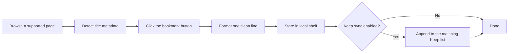

# KeepShelf

<p align="center">
  
</p>

<p align="center">
  <strong>Save movies, series, anime, and books while you browse.<br>
  Build a local shelf and sync it to Google Keep in one click.</strong>
</p>

<p align="center">
  <a href="manifest.json"></a>
  <a href="manifest.json"></a>
  <a href="LICENSE"></a>
  <a href="package.json"></a>
  <a href="package.json"></a>
</p>

<p align="center">
  <a href="#quick-start">Quick start</a> ·
  <a href="#features">Features</a> ·
  <a href="#supported-sources">Sources</a> ·
  <a href="#google-keep-sync">Keep sync</a> ·
  <a href="#install-from-github">Install</a>
</p>

---

## At a glance

| | |
|---|---|
| **What it does** | Parses title metadata from Google, IMDb, Goodreads, and more, then saves a clean one-line entry to your shelf |
| **Where data lives** | Locally in Chrome storage on your device. Optional sync to your own Google Keep notes |
| **Who it is for** | Anyone building a watchlist, reading list, or recommendation backlog without copy-pasting |
| **Setup time** | About 2 minutes to load the extension. About 5 minutes to link Keep notes if you want sync |
| **Cost** | Free and open source. No accounts, no API keys, no cloud backend |

---

## Table of contents

- [Why KeepShelf exists](#why-keepshelf-exists)
- [Quick start](#quick-start)
- [How it works](#how-it-works)
- [Features](#features)
- [Supported sources](#supported-sources)
- [Output format](#output-format)
- [Install from GitHub](#install-from-github)
- [Usage guide](#usage-guide)
- [Google Keep sync](#google-keep-sync)
- [Privacy and data](#privacy-and-data)
- [Permissions explained](#permissions-explained)
- [Development](#development)
- [FAQ](#faq)
- [Troubleshooting](#troubleshooting)
- [Contributing](#contributing)
- [License](#license)
- [GitHub repo metadata](#github-repo-metadata)

---

## Why KeepShelf exists

Someone sends ten movie and book recommendations. The usual workflow looks like this:

1. Google the title
2. Copy the name, year, and rating by hand
3. Switch to Google Keep or a notes app
4. Paste one formatted line
5. Repeat nine more times

That takes minutes per title. KeepShelf reduces it to **search, save, next**.

You stay on the page you are already on. KeepShelf reads the knowledge panel or page metadata, formats a single clean line, stores it locally, and (if you enable it) pushes that line into the right Google Keep checklist in the background.

No copy-pasting. No tab juggling. No spreadsheet middleman.

---

## Quick start

Already have the extension loaded? Skip to step 3.

```bash
git clone https://github.com/thefznkhan/KeepShelf.git
cd KeepShelf
npm install
node scripts/generate-icons.mjs
npm run build
```

1. Open `chrome://extensions`, enable **Developer mode**, click **Load unpacked**, and select this folder.
2. Pin KeepShelf to your Chrome toolbar.
3. Search a movie on Google (or open an IMDb title page).
4. Click the blue **bookmark** button that appears at the bottom right.
5. Open the KeepShelf popup to see your saved line.

Want automatic Keep sync? Jump to [Google Keep sync](#google-keep-sync).

---

## How it works



**Step by step**

1. **Detect** supported pages: Google knowledge panels, IMDb title pages, Goodreads book pages, and more.
2. **Parse** title, year, runtime or season count, author (for books), and ratings where available.
3. **Save** to your local KeepShelf list with duplicate detection.
4. **Sync** optionally to Google Keep: media titles go to your Media note, books go to your Books note.

---

## Features

### One-click save button

A floating blue bookmark button appears on supported pages. It is icon-only, stays out of your way, and saves the current title with parsed metadata in one click.

### Smart, consistent formatting

Every item becomes a single readable line, ready for Keep or clipboard export:

| Type | What gets captured |
|------|-------------------|
| **Movies** | Title, year, runtime, IMDb rating |
| **Series** | Title, year, latest season, IMDb rating |
| **Anime** | Same as series (detected via Google knowledge panel) |
| **Books** | Title, author, year, Goodreads or BookFilter rating |

Ratings are labeled clearly: `IMDb 8.4`, `GR 3.92`, `BF 3.78`.

### Local shelf popup

Open the toolbar popup to manage everything:

- Filter by **All**, **Movies**, **Series**, **Anime**, or **Books**
- **Copy all** or **Copy selected** as plain text
- Delete individual items or **Clear all** (with a themed confirmation dialog)
- See when each item was saved

Your shelf survives browser restarts. Data is stored in `chrome.storage.local`.

### Google Keep sync

Link two Keep checklist notes: one for media, one for books. Every new save can append as an unchecked list item in the matching note.

- Works with a personal `@gmail.com` account
- No Google Cloud project or OAuth app setup
- Duplicate lines are skipped automatically
- If sync fails, the line is copied to your clipboard and your Keep note opens

### Duplicate detection

Saving the same title twice shows an on-page toast and skips adding a duplicate locally or in Keep.

### On-page toasts, not system notifications

Save results, Keep sync status, and errors appear as styled in-page toasts. No Chrome notification popups.

### Privacy-first by design

Everything stays on your device unless you turn on Keep sync. No analytics server. No external storage API. No third-party data collection.

---

## Supported sources

| Source | Page type | Captures |
|--------|-----------|----------|
| [Google Search](https://www.google.com) | Knowledge panel on search results | Movies, series, anime, books |
| [IMDb](https://www.imdb.com) | Title pages (`/title/tt…`) | Movies and TV with IMDb rating |
| [Series Graph](https://seriesgraph.com) | Show pages (`/show/…`) | Series with season count and IMDb rating |
| [Goodreads](https://www.goodreads.com) | Book pages (`/book/show/…`) | Title, author, year, GR rating |
| [BookFilter](https://www.book-filter.com) | Book pages (`/books/…`) | Title, author, year, BF rating |

### Tips for best results

**Google Search**

- For anime, include the word `anime` in your query so the panel is classified correctly.
- Books can also be saved directly from Google knowledge panels.
- If a book save is missing the author, scroll the knowledge panel to load more details, then save again.

**IMDb and Series Graph**

- Wait for the page to finish loading before clicking save.

**Goodreads and BookFilter**

- Wait for ratings and metadata to render before saving.

---

## Output format

Every saved item becomes one line. These are real examples of the format KeepShelf produces:

### Movies

```
The Shawshank Redemption (1994) | 2h 22m | IMDb 9.3
Inception (2010) | 2h 28m | IMDb 8.8
Avengers: Infinity War (2018) | 2h 29m | IMDb 8.4
```

### Series

```
Dark (2017) | S03 | IMDb 8.7
Daredevil (2015) | S03 | IMDb 8.6
```

### Books (Goodreads / BookFilter)

```
The Kite Runner (Khaled Hosseini) | 2003 | GR 4.36
The Alchemist (Paulo Coelho) | 1988 | BF 3.78
```

### Books (Google, no rating available)

```
A Song of Ice and Fire (George R. R. Martin)
A Game of Thrones (George R. R. Martin) | 1996
```

Use **Copy all** in the popup to export your entire shelf as plain text.

---

## Install from GitHub

### Requirements

- [Google Chrome](https://www.google.com/chrome/) or a Chromium-based browser (Edge, Brave, Arc, etc.)
- [Node.js](https://nodejs.org/) 18 or newer
- [Git](https://git-scm.com/)

### Build and load

```bash
git clone https://github.com/thefznkhan/KeepShelf.git
cd KeepShelf
npm install
node scripts/generate-icons.mjs
npm run build
```

Load the extension in Chrome:

1. Open `chrome://extensions`
2. Enable **Developer mode** (top right toggle)
3. Click **Load unpacked**
4. Select the cloned `KeepShelf` folder (the directory that contains `manifest.json`)
5. Pin KeepShelf to your toolbar for quick access

### Updating after `git pull`

```bash
npm install
npm run build
```

Then click **Reload** on the KeepShelf card at `chrome://extensions`.

---

## Usage guide

### Save a title

1. Visit a supported page (Google search with a knowledge panel, IMDb, Goodreads, etc.)
2. Click the blue **bookmark** button at the bottom right of the page
3. An on-page toast confirms the save and shows the formatted line

### Manage your shelf

1. Click the KeepShelf icon in your toolbar
2. Use the filter chips to narrow by type
3. Select items with checkboxes, then **Copy selected**, or use **Copy all**
4. Delete selected items with the trash icon, or **Clear all** to wipe the shelf (Keep lists are not affected)

### Configure Keep sync

1. Open **Settings** (gear icon in the popup)
2. Paste your **Media list note URL** and **Books list note URL**
3. Enable **Auto-add saves to Google Keep**
4. Run **Test media list** and **Test books list** to verify the links
5. Click **Save settings**

---

## Google Keep sync

KeepShelf can append each saved line directly into Google Keep **list notes**. This works with a personal Google account. No OAuth app or Google Cloud project is required.

### Step 1: Create two Keep list notes

In [Google Keep](https://keep.google.com), create two checklist notes:

| Note | Use for |
|------|---------|
| **Media watchlist** | Movies, series, and anime |
| **Books list** | Books and book series |

Enable **Show checkboxes** on each note (the list-item format).

### Step 2: Copy the full note URLs

Open each note and copy the complete URL from your address bar:

```
https://keep.google.com/#LIST/your-long-list-id-here
```

The list ID must be complete (typically 40+ characters). Short or truncated links will not work. If settings show **URL looks incomplete**, paste the full link again from the browser bar.

### Step 3: Link them in KeepShelf

Open KeepShelf **Settings** and:

1. Turn on **Auto-add saves to Google Keep**
2. Paste the **Media list note URL**
3. Paste the **Books list note URL**
4. Click **Save settings**
5. Run both test buttons while signed into Keep in Chrome

### What happens on each save

| Step | Behavior |
|------|----------|
| Local save | Item is always stored in KeepShelf first |
| Keep routing | Movies, series, and anime go to the Media note; books go to the Books note |
| Background sync | Keep opens in a background tab; you stay on your current page |
| Duplicate skip | Identical lines are not added twice |
| Failure fallback | If append fails, the line is copied to your clipboard and your Keep note opens |

### Why the debugger permission?

Google Keep only persists list items when they are entered through trusted browser input. KeepShelf briefly uses Chrome's debugger API to send that trusted text so your lines survive after you close the note.

You may see a short banner: **"KeepShelf started debugging this browser"**. It disappears when sync finishes. This is normal and required for reliable Keep persistence.

---

## Privacy and data

| Data | Where it lives |
|------|----------------|
| Saved shelf items | `chrome.storage.local` on your device |
| Keep settings (URLs, toggle) | `chrome.storage.local` on your device |
| Keep list content | Your Google Keep account (only if sync is enabled) |

KeepShelf does **not** send your data to any third-party server. Keep sync communicates only with `keep.google.com` inside your existing browser session.

Uninstalling the extension removes local shelf data. Your Google Keep notes are never deleted by KeepShelf.

---

## Permissions explained

| Permission | Why KeepShelf needs it |
|------------|------------------------|
| `storage` | Save your shelf and settings locally |
| `tabs` | Find or open linked Keep note tabs for sync |
| `scripting` | Run the Keep append script in your Keep tab |
| `debugger` | Send trusted text input so Keep persists list items |
| `google.com`, `imdb.com`, `seriesgraph.com`, `goodreads.com`, `book-filter.com` | Parse page metadata and show the save button |
| `keep.google.com` | Append lines to your linked Keep notes |

---

## Development

### Commands

```bash
npm run build    # Compile TypeScript to dist/
npm test         # Run 52 parser and format tests
npm run watch    # Rebuild on file changes
```

### Project structure

```
KeepShelf/
├── src/
│   ├── background/       # Service worker (save, sync, settings)
│   ├── content/          # Page scripts, save button, toasts
│   ├── popup/            # Shelf UI and settings overlay
│   └── shared/           # Parsers, formatters, Keep sync, storage
├── tests/
│   ├── fixtures/         # HTML snapshots for parser tests
│   └── *.test.mjs
├── icons/                # Extension icons (generated from icon.png)
├── scripts/
│   ├── build.mjs
│   ├── build-test-parser.mjs
│   └── generate-icons.mjs
├── dist/                 # Built extension output (loaded by manifest)
└── manifest.json
```

### Regenerate icons

After changing `icons/icon.png`:

```bash
node scripts/generate-icons.mjs
```

### Running tests

Tests use saved HTML fixtures from real pages to verify parsers stay accurate as site layouts change:

```bash
npm test
```

---

## FAQ

**Does KeepShelf work without Google Keep?**

Yes. The local shelf works on its own. Keep sync is optional.

**Can I use one Keep note for everything?**

KeepShelf routes media and books to separate notes. You can paste the same URL in both fields if you prefer a single list.

**Will my shelf survive an extension update?**

Yes, as long as you reload the extension rather than removing and reinstalling it. Removing the extension clears local storage.

**Why did my Keep line disappear after I closed the note?**

That happens when text is inserted in a way Keep does not persist. Reload the extension to ensure the latest sync logic is active, then save again.

**Does this work on Firefox?**

KeepShelf is built for Chromium Manifest V3. Firefox would need a separate port.

**Is there a Chrome Web Store listing?**

Not yet. Install from source using the steps above.

---

## Troubleshooting

| Problem | What to try |
|---------|-------------|
| Save button does not appear | Confirm the URL is supported and the page panel has fully loaded |
| Keep line vanishes after closing the note | Reload the extension; Keep needs trusted input to persist |
| "URL looks incomplete" in settings | Paste the full `#LIST/…` URL from the browser address bar |
| Book saved without author (Google) | Scroll the knowledge panel, then save again |
| Keep test fails | Stay signed into Keep in Chrome; open the list note once manually |
| Old icon after update | Reload at `chrome://extensions`, or restart Chrome |
| Changes missing after `git pull` | Run `npm run build`, then reload the extension |
| Duplicate toast on first save | The same title was already on your shelf from a previous session |

---

## Contributing

Issues and pull requests are welcome.

1. Fork the repository
2. Create a branch: `git checkout -b feature/my-change`
3. Make your changes and run `npm test`
4. Open a pull request with a clear description of what changed and why

Please keep user-facing copy free of em-dashes. Use periods, commas, or colons instead.

---

## License

[MIT](LICENSE). Free to use, modify, and distribute.

---

## GitHub repo metadata

When you publish this repository, set these under **Settings → General → About**:

**Description**

```
Open-source Chrome extension: save movies, series, anime and books from Google, IMDb, Goodreads and Series Graph. Sync your watchlist and reading list to Google Keep.
```

**Topics**

```
chrome-extension
google-keep
watchlist
reading-list
movie-tracker
book-tracker
imdb
goodreads
anime
productivity-tools
manifest-v3
media-list
open-source
```
